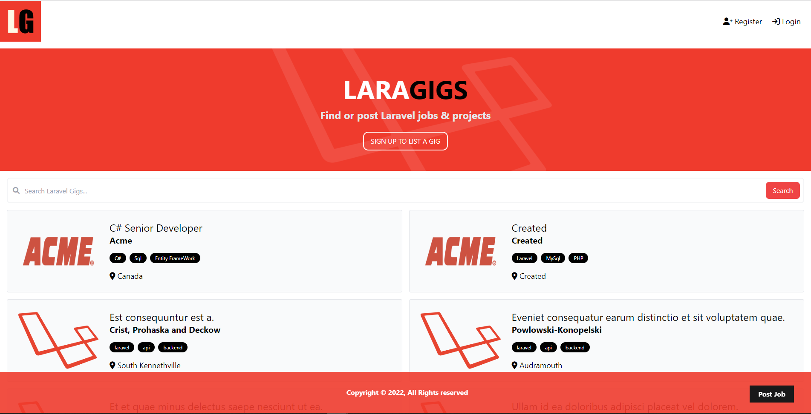

<h1 align="center"> 
    
    <p>Laragigs 📑</p>
</h1>

## 📕 About


This project was developed at the end of a **Laravel** foundation course. Enables registration of Gigs. It has in its composition, authentication, image upload, pagination, database connection etc...


## 🔨 Tools

- [Laravel](https://laravel.com/)
- [MySQL](https://www.mysql.com/)

## 👩🏿‍💻 The project 



## 🤗 How Contribute

```bash
    # Clone the project
    $ git clone https://github.com/CrislaineLuana/LaragigsProjectLaravel.git
```

```bash
    # Enter directory
    $ cd LaragigsProjectLaravel
```

```bash
    # Install dependencies
    $ composer install
```

```bash
    # Copy .env.exemple to .env
    $ php -r "copy('.env.example', '.env');"
```

```bash
    # Generate artisan key
    $ php artisan key:generate
```

```bash
    # Update the database info in .env directory with your connection
```
 


 ```bash
    # Make a migration
    $ php artisan migrate
```

 ```bash
    # Run the project
    $ php artisan serve
```

## 📃 Rights
https://github.com/bradtraversy/laragigs